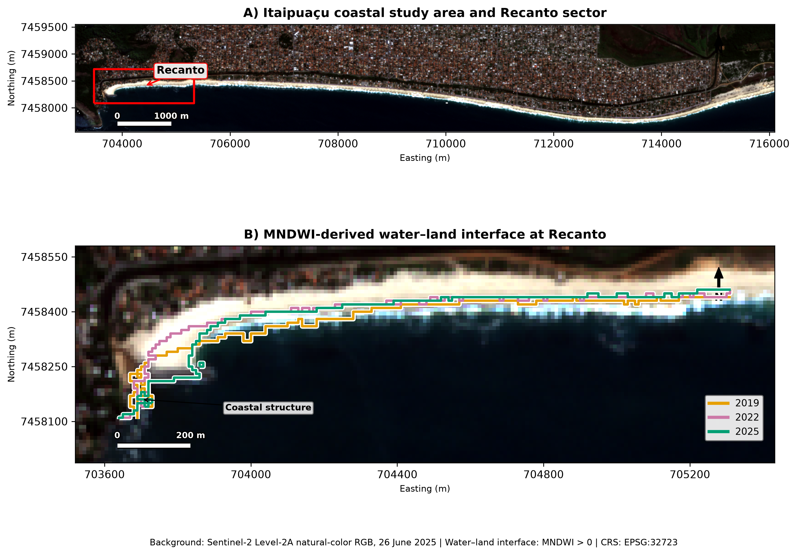
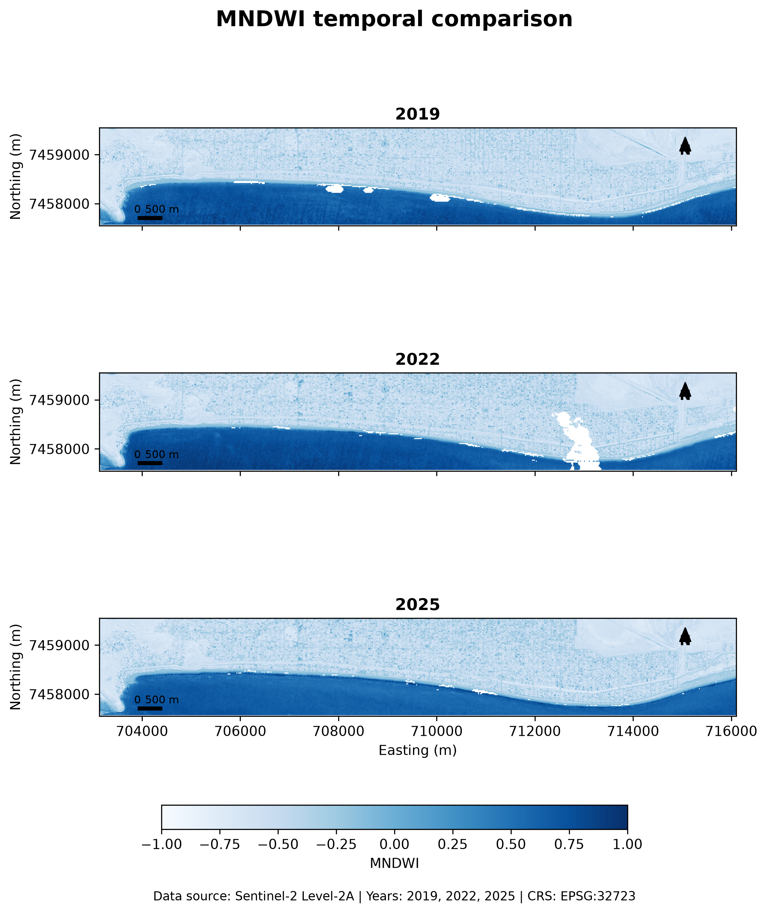
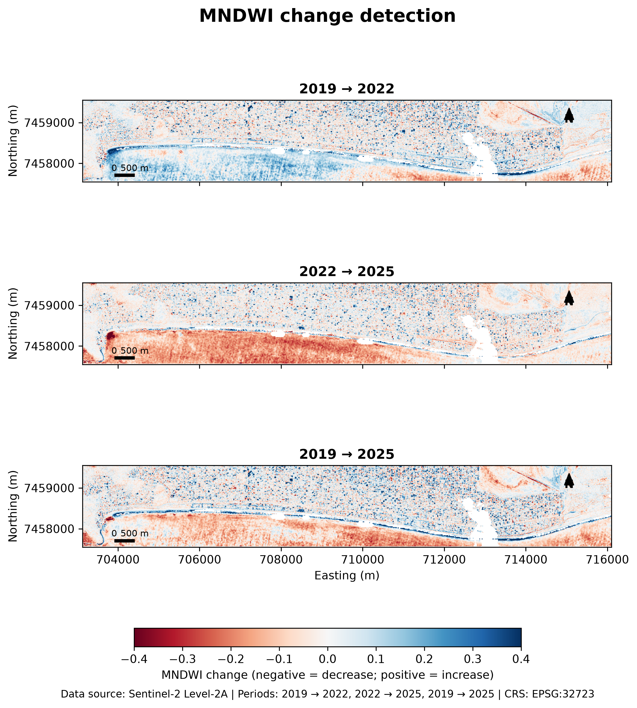
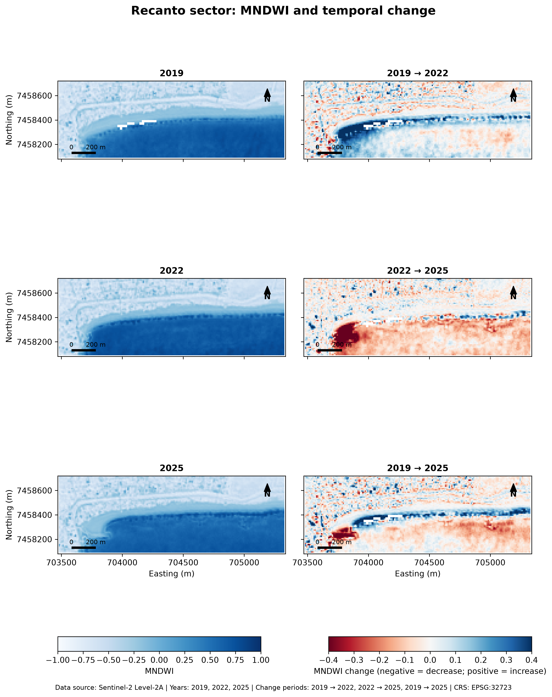
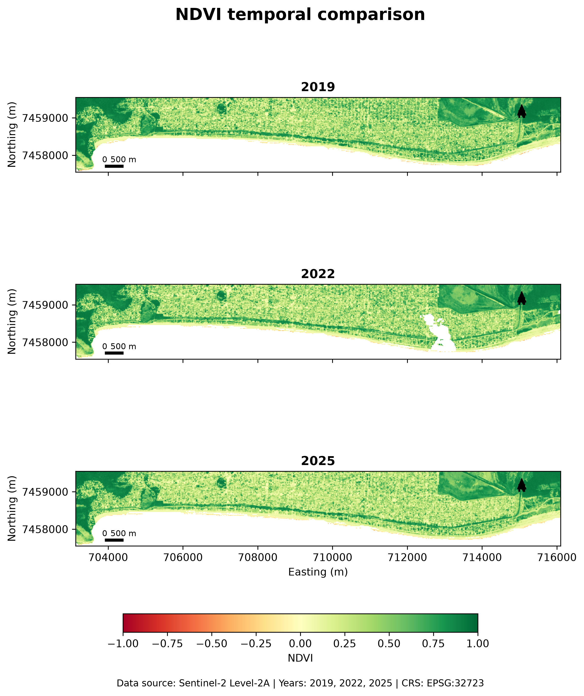
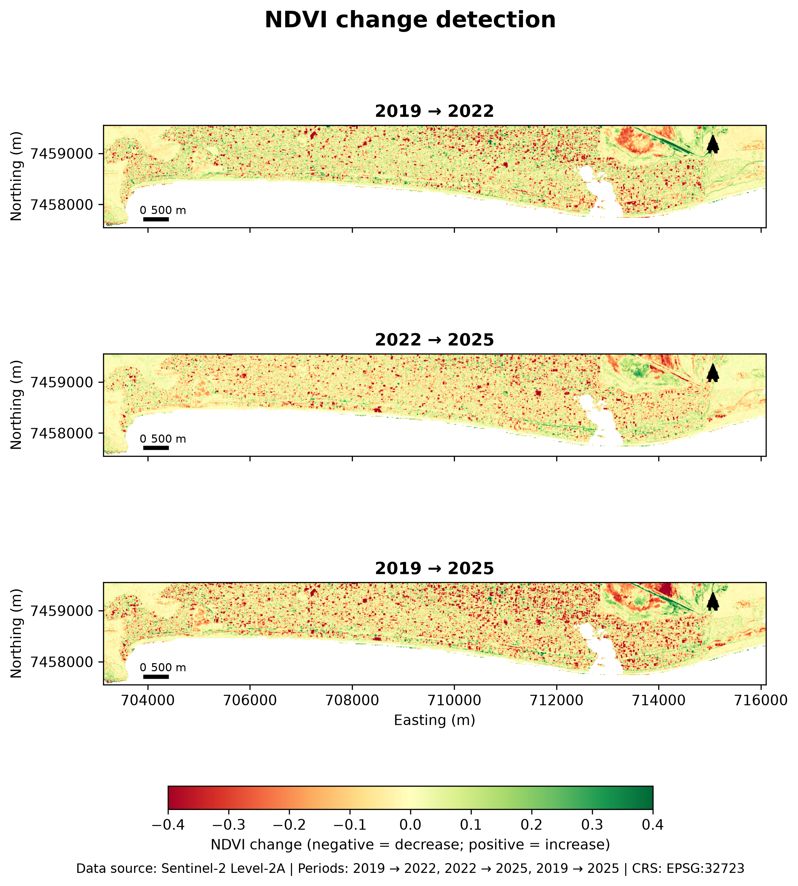
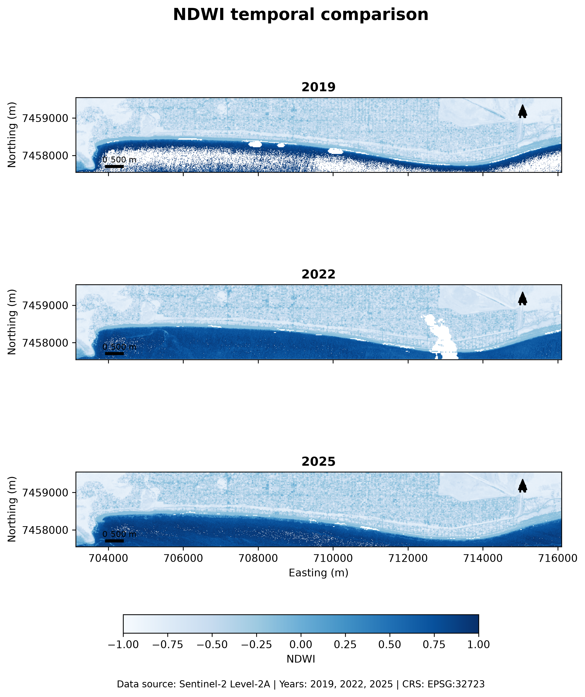
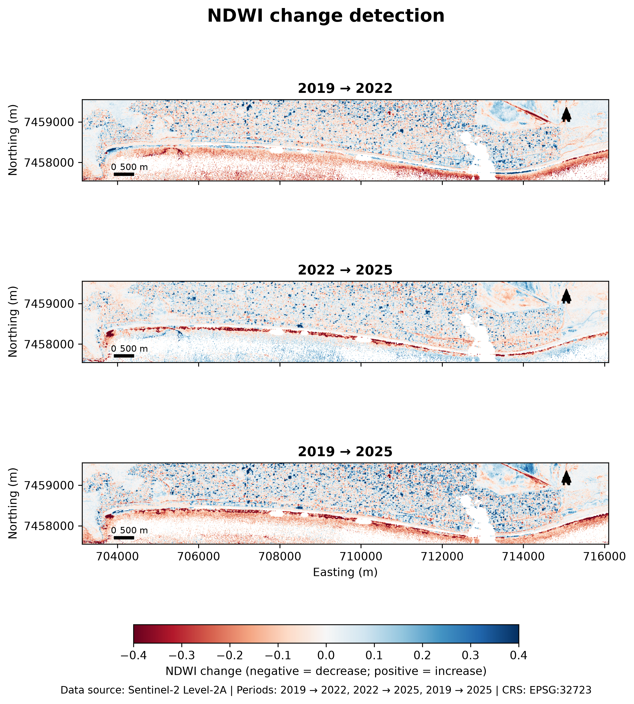

# Sentinel-2 Coastal Change Analysis — Itaipuaçu, Maricá, Brazil

Multitemporal coastal analysis using Sentinel-2 Level-2A imagery from 2019, 2022, and 2025.

The project combines spectral indices, temporal change detection, quality masking, and a focused analysis of the Recanto sector in Itaipuaçu, Maricá (Rio de Janeiro, Brazil). A water–land interface was also extracted from MNDWI-derived water masks to support visual comparison between acquisition dates.



---

## Project overview

Coastal environments are highly dynamic, and satellite imagery provides a practical way to examine spatial changes through time.

This project was developed as a reproducible geospatial workflow for comparing three Sentinel-2 observations of the Itaipuaçu coast:

- 18 June 2019
- 22 June 2022
- 26 June 2025

The analysis covers the broader Itaipuaçu coastal sector and includes a more detailed investigation of the Recanto area.

The workflow includes:

- Sentinel-2 Level-2A preprocessing
- spatial clipping to a common coastal area of interest
- Scene Classification Layer (SCL) quality masking
- radiometric conversion to surface reflectance
- NDVI, NDWI, and MNDWI calculation
- common-valid masks for temporal comparison
- raster-based change detection
- focused analysis of the Recanto sector
- MNDWI-derived water masks
- water–land interface extraction
- true-color Sentinel-2 visualization
- publication-quality figures and summary tables

---

## Study area

The study area is located along the coast of Itaipuaçu, in the municipality of Maricá, Rio de Janeiro, southeastern Brazil.

Two spatial extents are used:

- a broader coastal AOI covering the Itaipuaçu study sector;
- a smaller AOI focused on the Recanto area.

The Recanto sector was analyzed in greater detail because it contains a coastal structure and shows localized differences in the position of the water–land interface between the selected dates.

The analysis uses UTM Zone 23S:

```text
EPSG:32723
```

---

## Satellite data

Three Sentinel-2 Level-2A products from tile `23KQQ` were used.

| Year | Acquisition date | Satellite |
|---|---|---|
| 2019 | 2019-06-18 | Sentinel-2A |
| 2022 | 2022-06-22 | Sentinel-2A |
| 2025 | 2025-06-26 | Sentinel-2C |

Products used:

```text
S2A_MSIL2A_20190618T130251_N0500_R095_T23KQQ_20230624T035130.SAFE
S2A_MSIL2A_20220622T130301_N0510_R095_T23KQQ_20240702T184033.SAFE
S2C_MSIL2A_20250626T130311_N0511_R095_T23KQQ_20250626T172059.SAFE
```

The original `.SAFE` products are not included in this repository because of their size.

They must be placed locally inside:

```text
data/raw/
```

---

## Spectral bands

The workflow uses the following Sentinel-2 bands:

| Band | Description | Native resolution |
|---|---|---:|
| B02 | Blue | 10 m |
| B03 | Green | 10 m |
| B04 | Red | 10 m |
| B08 | Near Infrared | 10 m |
| B11 | SWIR 1 | 20 m |
| B12 | SWIR 2 | 20 m |

B11 and B12 are first clipped at their native 20 m resolution and then resampled to the 10 m reference grid using bilinear interpolation.

The Scene Classification Layer is also read at 20 m and resampled to the 10 m analysis grid using nearest-neighbor interpolation.

---

## Radiometric preprocessing

The Sentinel-2 Level-2A products used in this project contain a BOA quantification value of:

```text
10000
```

and a BOA additive offset of:

```text
-1000
```

Surface reflectance is therefore calculated as:

```text
Reflectance = (DN - 1000) / 10000
```

Pixels with DN equal to zero are treated as NoData.

---

## Quality masking

The Sentinel-2 Scene Classification Layer is used to remove unreliable observations.

The following SCL classes are excluded:

```text
0   No data
1   Saturated or defective
3   Cloud shadows
8   Clouds — medium probability
9   Clouds — high probability
10  Thin cirrus
11  Snow or ice
```

For NDVI, SCL class 6 (water) is also excluded.

Only valid pixels are used in the spectral-index calculations.

---

## Spectral indices

Three normalized spectral indices are calculated.

### NDVI — Normalized Difference Vegetation Index

```text
NDVI = (B08 - B04) / (B08 + B04)
```

Used to examine changes in vegetation-related spectral response.

### NDWI — Normalized Difference Water Index

```text
NDWI = (B03 - B08) / (B03 + B08)
```

Used to enhance water-related spectral response.

### MNDWI — Modified Normalized Difference Water Index

```text
MNDWI = (B03 - B11) / (B03 + B11)
```

Used for water discrimination and for the detailed Recanto water–land interface analysis.

---

## Common-valid masks

Cloud cover, shadows, NoData, and other invalid observations are not identical between acquisition dates.

To avoid interpreting missing observations as temporal change, the project creates a common-valid mask for each spectral index.

A pixel is included in a temporal comparison only when it is valid in all three acquisition dates.

This ensures that change rasters compare the same spatial sample.

---

## Change detection

Temporal differences are calculated by subtracting the earlier raster from the later raster:

```text
2019 → 2022
2022 → 2025
2019 → 2025
```

For example:

```text
MNDWI change = MNDWI_later - MNDWI_earlier
```

Equivalent products are generated for NDVI and NDWI.

The outputs are spectral differences rather than direct measurements of geomorphological erosion or accretion.

---

## Temporal comparison

### MNDWI



### MNDWI change detection



MNDWI was particularly useful for examining the coastal water–land transition and was therefore selected for the detailed Recanto analysis.

---

## Recanto sector

A separate processing workflow was applied to the Recanto AOI.

For each acquisition date, the project generates:

- NDWI
- MNDWI
- local common-valid masks
- temporal change rasters
- summary statistics
- MNDWI-derived water masks
- vector water–land interfaces

### Recanto MNDWI comparison



---

## MNDWI-derived water–land interface

A binary water mask is generated independently for each date using:

```text
MNDWI > 0
```

Values are classified as:

```text
1    water
0    non-water
255  NoData
```

The water mask is polygonized, the largest connected water body is selected, and its boundary is extracted.

Artifacts associated with the AOI limits are reduced by excluding the outer portion of the clipped analysis area.

The resulting vectors are:

```text
outputs/vectors/recanto_waterlines/
├── waterline_mndwi_2019.geojson
├── waterline_mndwi_2022.geojson
└── waterline_mndwi_2025.geojson
```

These features are described as **MNDWI-derived water–land interfaces**.

They should not be interpreted as survey-grade shoreline positions.

---

## Recanto interface comparison

The final figure combines:

- a 2025 Sentinel-2 true-color image of the Itaipuaçu study area;
- the Recanto analysis extent;
- detailed MNDWI-derived interfaces for 2019, 2022, and 2025;
- the location of the coastal structure.


The true-color background uses Sentinel-2 bands:

```text
Red   = B04
Green = B03
Blue  = B02
```

A percentile stretch is applied for visualization.

---

## Additional outputs

### NDVI temporal comparison



### NDVI change detection



### NDWI temporal comparison



### NDWI change detection



---

## Output tables

Two CSV summaries are included:

```text
outputs/tables/change_summary.csv
outputs/tables/recanto_change_summary.csv
```

The first summarizes temporal spectral changes across the broader Itaipuaçu AOI.

The second contains the corresponding analysis for the Recanto sector.

---

## Repository structure

```text
sentinel2-coastal-change-marica/
│
├── data/
│   ├── aoi/
│   │   ├── itaipuacu_coastal_aoi.geojson
│   │   └── recanto_focus_aoi.geojson
│   │
│   ├── raw/
│   │   └── .gitkeep
│   │
│   └── processed/
│       └── .gitkeep
│
├── outputs/
│   ├── figures/
│   ├── tables/
│   └── vectors/
│       └── recanto_waterlines/
│
├── scripts/
│   └── check_publication.py
│
├── src/
│   ├── change_detection.py
│   ├── extract_waterline.py
│   ├── inspect_radiometry.py
│   ├── load_raster.py
│   ├── main.py
│   ├── plots.py
│   ├── preprocess.py
│   ├── recanto_analysis.py
│   ├── rgb_utils.py
│   ├── spectral_indices.py
│   ├── water_mask.py
│   └── __init__.py
│
├── tests/
│   └── test_water_mask.py
│
├── .dockerignore
├── .gitattributes
├── .gitignore
├── Dockerfile
├── requirements.txt
├── requirements-dev.txt
└── README.md
```

---

## Running the project with Docker

The complete workflow was tested using Docker.

Build the image from the project root:

```powershell
docker build --no-cache -t sentinel2-coastal-change-marica .
```

The three Sentinel-2 `.SAFE` products must already be available inside:

```text
data/raw/
```

Run the workflow in PowerShell:

```powershell
$project = (Get-Location).Path

docker run --rm `
  --mount "type=bind,source=$project/data/raw,target=/app/data/raw,readonly" `
  --mount "type=bind,source=$project/data/processed,target=/app/data/processed" `
  --mount "type=bind,source=$project/outputs,target=/app/outputs" `
  sentinel2-coastal-change-marica
```

The pipeline processes the three Sentinel-2 scenes and generates the spectral indices, change products, Recanto analysis, water masks, vector interfaces, tables, and figures.

---

## Local Python environment

Runtime dependencies are listed in:

```text
requirements.txt
```

Development and test dependencies are listed in:

```text
requirements-dev.txt
```

To run the automated test:

```powershell
python -m pytest -q
```

---

## Main technologies

- Python
- Rasterio
- GeoPandas
- Shapely
- NumPy
- Pandas
- Matplotlib
- PyProj
- Pyogrio
- QGIS
- Docker
- Git

---

## Methodological considerations

This project is designed as a multitemporal remote-sensing analysis and portfolio workflow. Several limitations must be considered when interpreting the outputs.

The three images are individual observations acquired in June of 2019, 2022, and 2025. They do not represent a continuous coastal time series.

The MNDWI-derived interfaces may be influenced by:

- tide level;
- wave conditions;
- wave run-up;
- wet sand;
- turbidity;
- mixed pixels;
- image geolocation;
- spectral threshold selection.

Although the final analysis grid has a 10 m pixel size, MNDWI uses Sentinel-2 B11, whose native spatial resolution is 20 m. Resampling B11 to 10 m does not create additional spatial information.

For these reasons, the extracted features are described as **water–land interfaces derived from MNDWI**, rather than precise shoreline positions.

The spectral change rasters should likewise be interpreted as changes in index values, not as direct proof of erosion, accretion, vegetation loss, or other physical processes without additional field or environmental information.

---

## Purpose

This project was developed as a geospatial portfolio project demonstrating a reproducible workflow for:

- multispectral satellite-image processing;
- raster preprocessing;
- spectral-index analysis;
- temporal comparison;
- remote-sensing quality control;
- raster-to-vector extraction;
- coastal geospatial analysis;
- Python geoprocessing;
- Docker-based reproducibility;
- scientific visualization.

---

## Author

**Camila Américo dos Santos**

Environmental Scientist | PhD in Marine Biology and Coastal Environments | Geospatial Data Science